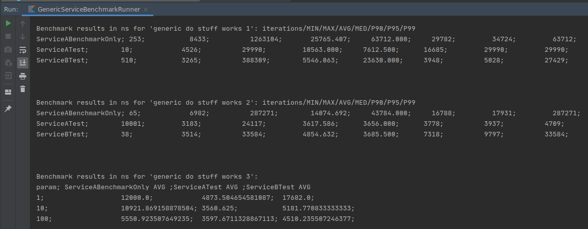

# benchmarkable-test-framework

## What and why?
This is a JUnit-based bramework that allows for easy testing and benchmarking 
multiple implementations of a single interface, to choose which one fits better for certain use case.

## Pictures
### Benchmark results


### Manually created JUnit tests


### Automatically created JUnit tests


## Usage example
See [example package](https://github.com/nikita-tomilov/benchmarkable-test-framework/tree/master/example)
for more information.

1. Pick the interface
    ```kotlin
    interface GenericService {
      fun doAnotherStuff()
    
      fun doAnotherStuff(arg: Int)
    }
    ```
2. Prepare implementations of this interface that you want to test/benchmark
3. Create the Benchmark class that implements ```BenchmarkableBase```
    ```kotlin
    open class GenericServiceBenchmark(
      private val target: GenericService
    ) : BenchmarkableBase() {
    
      @BenchmarkableTest
      fun `generic do stuff works 3`(i: Int) {
        target.doAnotherStuff(i)
        println("works 3")
      }
    
      @ParameterProvider("generic do stuff works 3")
      fun providerForTest3(): List<Int> = listOf(1, 10, 100)
     }
    ```
4. Prepare child classes that extend this benchmark class:

    4.1 Either simple ones
    ```kotlin
    class ServiceABenchmarkOnly : GenericServiceBenchmark(buildServiceA())
    ```
   
    4.2 Or ones with actual methods (for running methods one-by-one with JUnit)
    ```kotlin
    @TestInstance(TestInstance.Lifecycle.PER_CLASS)
    class ServiceATest : GenericServiceBenchmark(buildServiceA()) {
      @ParameterizedTest
      @MethodSource("paramSource")
      fun `do stuff works 3`(input: Int, expected: Boolean) {
        `generic do stuff works 3`(input)
      }
    
      private fun paramSource(): Stream<Arguments> =
          providerForTest3().map { Arguments.of(it, true) }.stream()
    ```
5. To **benchmark** this, create a runner class in your test package:
    ```kotlin
    object GenericServiceBenchmarkRunner {
      @JvmStatic
      fun main(args: Array<String>) {
        BenchmarkRunner.run(GenericServiceBenchmark::class.java)
      }
    }
    ```
6. To **test** these benchmarkable methods *one by one*, create classes and manually write actual tests as shown in 4.2

7. To **test** these benchmarkable methods *at the same time*, create JUnit runner class (it will
automatically create a TestFactory)
    ```kotlin
    class GenericServiceTest : AllTestsRunner<GenericService>(
        GenericServiceBenchmark::class.java, listOf(buildServiceA(), buildServiceB()))
    ```